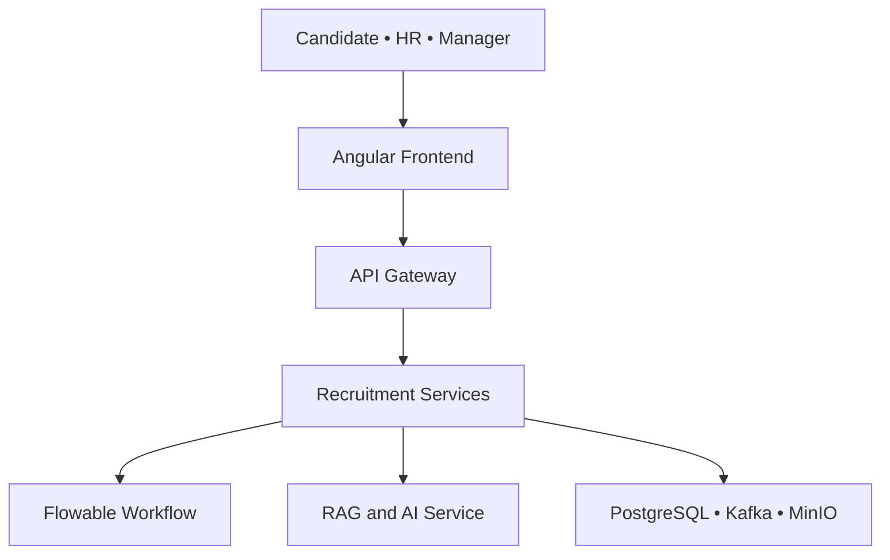
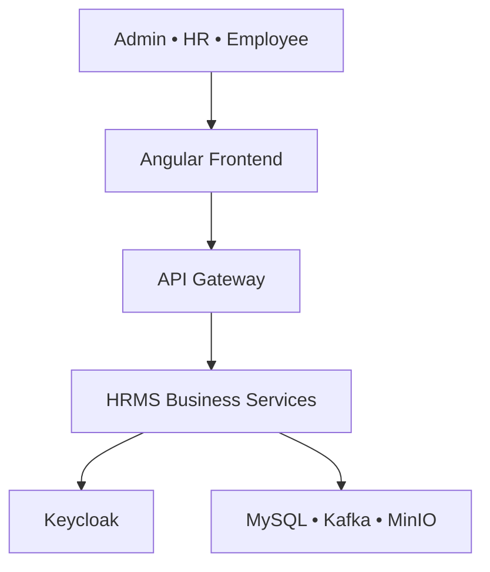

<div align="center">

# Hi there, I'm Iheb Chouaibi 👋

### Backend & Cloud Engineer • DevOps • Cybersecurity Enthusiast

Building secure and scalable applications with Java, Spring Boot, Angular,
microservices, AI and cloud-native technologies.

<p>
  <a href="https://github.com/ihabchouaibi">
    
  </a>
  <a href="https://github.com/ihabchouaibi?tab=followers">
    
  </a>
  <a href="https://github.com/ihabchouaibi?tab=repositories">
    
  </a>
</p>

<p>
  <a href="https://www.linkedin.com/in/iheb-chouaibi-00b4632a2/">
    
  </a>
  <a href="https://github.com/hrms-organisation">
    
  </a>
  <a href="https://github.com/recruitment-organisation">
    
  </a>
</p>

</div>

---

# 💫 About Me

```yaml
Name: Iheb Chouaibi
Location: Tunisia 🇹🇳

Education:
  Bachelor's Degree in Embedded Systems

Current Studies:
  Cloud Computing and Cybersecurity

Current Focus:
  - Java and Spring Boot
  - Angular
  - Microservices Architecture
  - Cloud and DevOps
  - Kubernetes and GitOps
  - Application Security
  - RAG and AI Integration

Currently Building:
  - Intelligent Recruitment Platform
  - HRMS Microservices Platform

Engineering Interests:
  - Distributed Systems
  - Cloud-Native Applications
  - DevSecOps
  - Identity and Access Management
  - Workflow Automation
  - Artificial Intelligence
```

---

# 🚀 Featured Engineering Projects

## 🧠 Intelligent Recruitment Platform

[](https://github.com/recruitment-organisation)

An intelligent recruitment ecosystem combining microservices, AI-powered CV
analysis, BPMN workflow automation and secure identity management.

### Main capabilities

- Candidate and employee management
- Job offer publication
- Application and CV management
- CV storage with MinIO
- AI-powered CV analysis
- RAG-based candidate matching
- Vector search with PostgreSQL and pgvector
- HR, technical and manager interviews
- Recruitment workflow with Flowable BPMN
- Authentication and roles with Keycloak
- Asynchronous communication with Kafka
- Docker image versioning with GitHub Actions
- Kubernetes deployment with Argo CD

### System architecture



### Services

```text
Intelligent Recruitment Platform
├── Infrastructure
│   ├── Gateway Service
│   ├── Discovery Service
│   └── Config Service
│
├── Identity
│   ├── Auth Service
│   └── Keycloak
│
├── Business
│   ├── Candidate Service
│   ├── Employee Service
│   ├── Job Offer Service
│   ├── Application Service
│   └── Interview Service
│
├── Process and AI
│   ├── Workflow Service
│   ├── Flowable BPMN
│   ├── RAG Service
│   └── Gemini AI
│
└── Data and Infrastructure
    ├── PostgreSQL
    ├── pgvector
    ├── MinIO
    └── Apache Kafka
```

### Repositories

| Service | Repository |
|---|---|
| Auth Service | [View](https://github.com/recruitment-organisation/auth-service) |
| Candidate Service | [View](https://github.com/recruitment-organisation/candidate-service) |
| Employee Service | [View](https://github.com/recruitment-organisation/employee-service) |
| Job Offer Service | [View](https://github.com/recruitment-organisation/job-offer-service) |
| Application Service | [View](https://github.com/recruitment-organisation/application-service) |
| Interview Service | [View](https://github.com/recruitment-organisation/interview-service) |
| Workflow Service | [View](https://github.com/recruitment-organisation/workflow-service) |
| RAG Service | [View](https://github.com/recruitment-organisation/rag-service) |
| Gateway Service | [View](https://github.com/recruitment-organisation/gateway-service) |

### RAG Service CI/CD

[](https://github.com/recruitment-organisation/rag-service/actions/workflows/ci.yml)

[](https://hub.docker.com/r/ihab0/rag-service)

[](https://hub.docker.com/r/ihab0/rag-service)

---

## 👥 HRMS Microservices Platform

[](https://github.com/hrms-organisation)

A distributed Human Resources Management System designed to manage employees,
organizational structures, leave requests, attendance and recruitment.

### Main capabilities

- Employee profile management
- Department and job management
- Leave requests and balances
- Employee attendance tracking
- Job offers and recruitment
- Role-based access control
- Keycloak authentication
- Kafka-based asynchronous communication
- Secure CV storage with MinIO and ClamAV
- Angular interfaces for HR and employees
- Docker and Kubernetes deployment
- GitOps delivery with Argo CD

### System architecture



### Services

```text
HRMS Platform
├── Infrastructure
│   ├── Gateway Service
│   ├── Discovery Service
│   └── Config Service
│
├── Identity
│   ├── Auth Service
│   └── Keycloak
│
├── Business
│   ├── Employee Service
│   ├── Organisation Service
│   ├── Leave Service
│   ├── Presence Service
│   └── Recruitment Service
│
├── Frontend
│   └── Angular Application
│
└── Data and Infrastructure
    ├── MySQL
    ├── Apache Kafka
    ├── MinIO
    └── ClamAV
```

### Repositories

| Service | Repository |
|---|---|
| Auth Service | [View](https://github.com/hrms-organisation/HRMS-auth-service) |
| Employee Service | [View](https://github.com/hrms-organisation/HRMS-employee-service) |
| Organisation Service | [View](https://github.com/hrms-organisation/HRMS-organisation-service) |
| Leave Service | [View](https://github.com/hrms-organisation/HRMS-leave-service) |
| Presence Service | [View](https://github.com/hrms-organisation/presence-service) |
| Recruitment Service | [View](https://github.com/hrms-organisation/HRMS-recruitment-service) |
| Gateway Service | [View](https://github.com/hrms-organisation/HRMS-gateway-service) |
| Discovery Service | [View](https://github.com/hrms-organisation/HRMS-discovery-service) |
| Config Service | [View](https://github.com/hrms-organisation/HRMS-config-service) |
| Angular Frontend | [View](https://github.com/hrms-organisation/frontend) |

---

# 💻 Technical Stack

## Backend

<p>
  
</p>

- Java 21
- Spring Boot
- Spring Cloud
- Spring Security
- Spring Data JPA
- OpenFeign
- REST APIs
- Flowable BPMN

## Frontend

<p>
  
</p>

- Angular
- TypeScript
- Responsive interfaces
- Role-based layouts
- Reusable UI components

## Databases and Storage

<p>
  
</p>

- PostgreSQL
- MySQL
- pgvector
- MinIO Object Storage

## Security

<p>
  
  
  
  
</p>

- Authentication and authorization
- Role-Based Access Control
- OAuth2 Resource Server
- OpenID Connect
- JWT access and refresh tokens
- Gateway security
- Service-to-service security

## Messaging and Workflow

<p>
  
  
</p>

- Event-driven communication
- Asynchronous processing
- BPMN workflow orchestration
- Business process automation

## AI and Data

<p>
  
</p>

- Retrieval-Augmented Generation
- Embeddings
- Vector similarity search
- PostgreSQL with pgvector
- Gemini AI
- PDF extraction
- Candidate matching

## DevOps and Cloud

<p>
  
</p>

- Docker
- Docker Compose
- Kubernetes
- GitHub Actions
- Argo CD
- GitOps
- Versioned Docker images
- CI/CD pipelines

---

# 🏆 Engineering Experience

✔️ Microservices architecture

✔️ REST API design and integration

✔️ Authentication and authorization

✔️ Event-driven communication with Kafka

✔️ BPMN workflow automation

✔️ RAG and vector search integration

✔️ Database-per-service architecture

✔️ Object storage with MinIO

✔️ Docker image optimization

✔️ Kubernetes orchestration

✔️ GitHub Actions CI/CD

✔️ GitOps deployment with Argo CD

✔️ Agile development and Scrum

---

# 📈 GitHub Analytics

<div align="center">


<br><br>


<br><br>


</div>

---

# 🔥 GitHub Streak

<div align="center">


</div>

---

# 🌱 Currently Learning

- Cloud architecture
- Advanced Kubernetes
- DevSecOps
- Distributed systems
- Application security
- AI agents
- RAG architecture
- System observability

---

# 🎯 2026 Goals

- Complete the Intelligent Recruitment Platform
- Build a production-ready RAG pipeline
- Improve my Kubernetes and GitOps expertise
- Strengthen my cybersecurity knowledge
- Obtain Cloud and Security certifications
- Contribute to open-source projects

---

# 📫 Contact

💼 **LinkedIn**

[Iheb Chouaibi](https://www.linkedin.com/in/iheb-chouaibi-00b4632a2/)

💻 **GitHub**

[ihabchouaibi](https://github.com/ihabchouaibi)

🏢 **Organizations**

- [HRMS Organisation](https://github.com/hrms-organisation)
- [Recruitment Organisation](https://github.com/recruitment-organisation)

---

<div align="center">

### ⭐ Thanks for visiting my profile!

*"Building secure, intelligent and scalable systems."*

</div>
