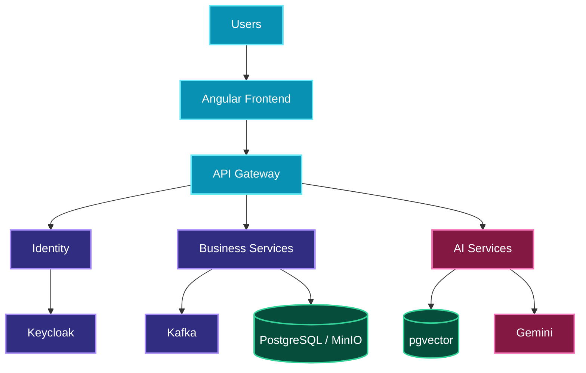
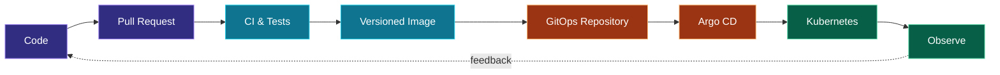

<div align="center">


<br />

<a href="https://github.com/IhabChouaibi"></a>
<a href="https://www.linkedin.com/in/iheb-chouaibi-00b4632a2/"></a>
<a href="https://github.com/recruitment-organisation"></a>

<br /><br />


<p>
  <code>secure by design</code>&nbsp; ◆ &nbsp;
  <code>automated by default</code>&nbsp; ◆ &nbsp;
  <code>observable in production</code>
</p>

</div>

---

## `01 // SYSTEM PROFILE`

<table>
<tr>
<td width="58%" valign="top">

### Hello, I'm Iheb 👋

Backend and cloud engineer based in Tunisia. I design secure distributed systems, build event-driven services, and deliver them through automated cloud-native platforms.

- **Current focus:** platform engineering, GitOps and AI-native backends
- **Core runtime:** Java 21, Spring Boot, Kafka and Kubernetes
- **Security:** Keycloak, OAuth2/OIDC, JWT and RBAC
- **AI systems:** RAG, embeddings, Gemini and pgvector

</td>
<td width="42%" valign="top">

```yaml
identity: Iheb Chouaibi
region: Tunisia
role: Backend / Cloud Engineer
runtime: Kubernetes
delivery: GitOps
status: online
```

</td>
</tr>
</table>

## `02 // TECHNOLOGY MATRIX`

<div align="center">

### Backend & distributed systems


`Java 21` · `Spring Boot` · `Spring Cloud` · `Spring Security` · `OpenFeign` · `Flowable BPMN`

### Platform & delivery


`Docker` · `Kubernetes` · `Helm` · `Argo CD` · `GitOps` · `GitHub Actions`

### Data, frontend & intelligence


`PostgreSQL` · `pgvector` · `MinIO` · `Angular` · `RAG` · `Gemini`

</div>

---

## `03 // FEATURED SYSTEMS`

<table>
<tr>
<td width="50%" valign="top">

### 🧠 Intelligent Recruitment Platform

An AI-powered recruitment ecosystem combining microservices, semantic analysis, workflow automation and secure identity.

`Spring Boot` `Angular` `Keycloak` `Kafka` `Flowable` `MinIO` `pgvector` `Gemini`

<br />

<a href="https://github.com/recruitment-organisation"></a>

</td>
<td width="50%" valign="top">

### ☸️ Recruitment GitOps

Declarative Kubernetes delivery with reusable Helm charts, environment overlays, automated synchronization and self-healing.

`ApplicationSets` `Helm` `Argo CD` `Kubernetes` `GitOps` `Ingress`

<br />

<a href="https://github.com/recruitment-organisation/recruitment-gitops"></a>

</td>
</tr>
<tr>
<td width="50%" valign="top">

### 🤖 RAG Service

Document ingestion, semantic retrieval and AI-assisted candidate analysis backed by vector search.

`Spring AI` `Gemini` `Embeddings` `PostgreSQL` `pgvector`

<br />

<a href="https://github.com/recruitment-organisation/rag-service"></a>

</td>
<td width="50%" valign="top">

### 👥 HRMS Platform

Event-driven services for employee lifecycle, recruitment, leave, attendance, identity and access control.

`Microservices` `Kafka` `MinIO` `Kubernetes` `GitOps` `RBAC`

<br />

<a href="https://github.com/hrms-organisation"></a>

</td>
</tr>
</table>

## `04 // PLATFORM TOPOLOGY`



## `05 // DELIVERY PIPELINE`



## `06 // SECURITY & AI`

<table>
<tr>
<td width="50%" valign="top">

### 🔐 Explicit trust boundaries

```text
user → authentication → identity provider
                         ↓ signed token
gateway → resource server → business API
```

OAuth2 · OIDC · JWT · RBAC · resource servers · least privilege

</td>
<td width="50%" valign="top">

### ✨ Retrieval-augmented intelligence

```text
PDF → extract → chunk → embed → pgvector
                                  ↓
query → embed → retrieve → Gemini → score
```

Semantic search · grounded generation · workflow automation

</td>
</tr>
</table>

---

## `07 // GITHUB TELEMETRY`

<div align="center">

<picture>
  <source media="(prefers-color-scheme: dark)" srcset="https://github-readme-stats.vercel.app/api?username=IhabChouaibi&show_icons=true&hide_border=true&bg_color=00000000&title_color=22D3EE&icon_color=F59E0B&text_color=E2E8F0&ring_color=7C3AED&include_all_commits=true" />
  
</picture>
<picture>
  <source media="(prefers-color-scheme: dark)" srcset="https://github-readme-stats.vercel.app/api/top-langs/?username=IhabChouaibi&layout=compact&langs_count=8&hide_border=true&bg_color=00000000&title_color=F472B6&text_color=E2E8F0" />
  
</picture>

<br /><br />


</div>

<details>
<summary><b>⚡ Open the command center</b></summary>

```bash
mvn test
docker build .
helm template ./chart
argocd app sync recruitment
kubectl get pods -A
```

</details>

<br />

<div align="center">


### `THE SYSTEM IS NEVER FINISHED — ONLY ITERATED.`


</div>
